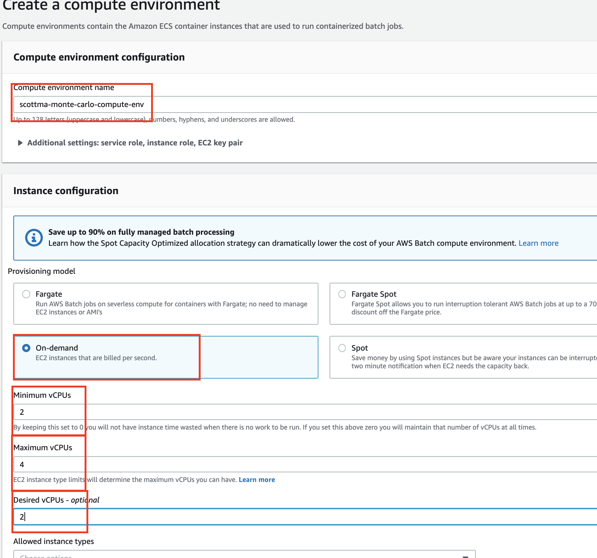
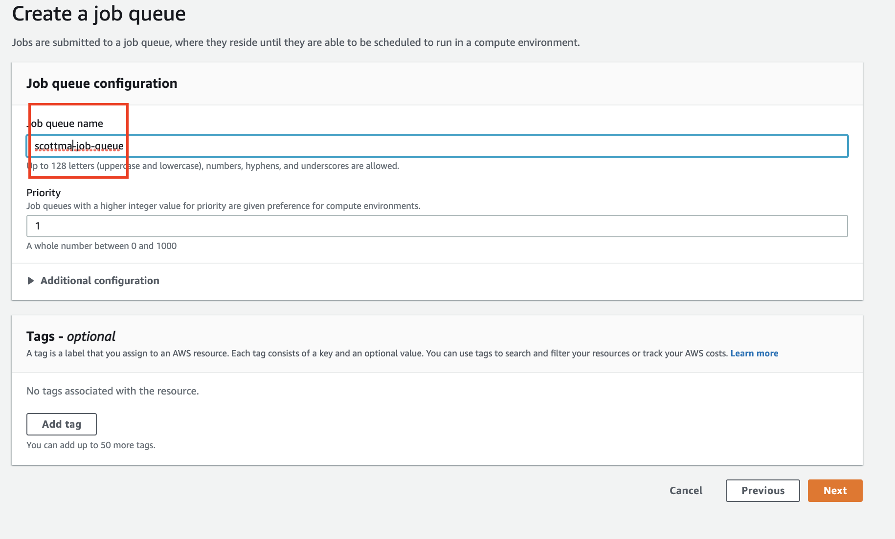
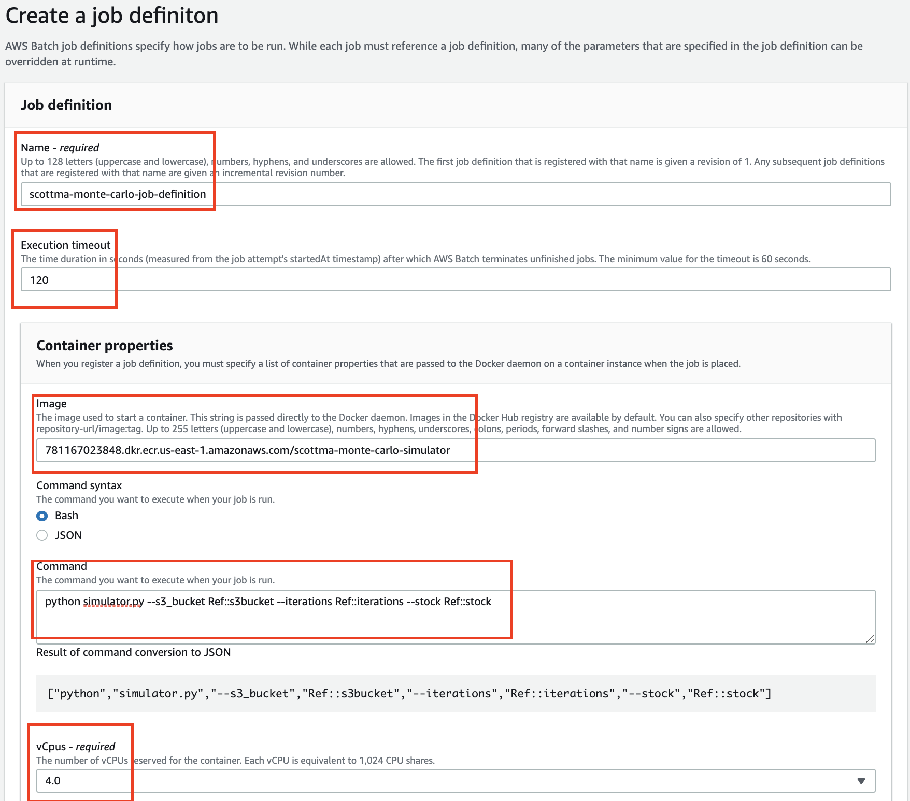
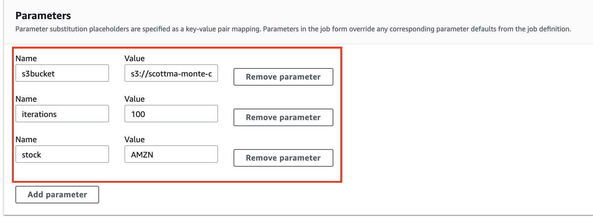
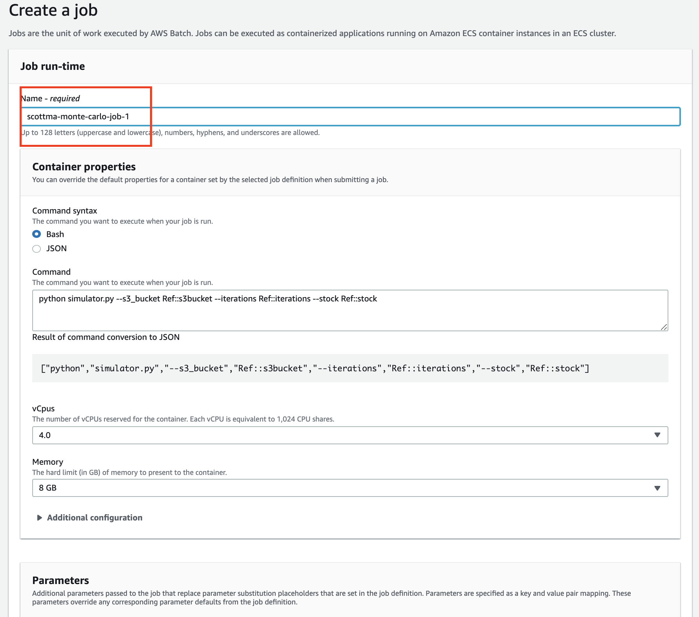

# Module 7: Create AWS Batch job 

In this section, we will use the AWS batch first run wizard to walk through:

* Create a managed compute environment (infrastructure that containers will run on)
* Create a job queue
* Create a job definition 
* Submit batch job

## Instructions

1. Click [here](https://console.aws.amazon.com/batch/home?#wizard) to go to the AWS Batch wizard 

1. Under **Create a compute environment**
	
	* **for compute environment name**: `<your-user-name>-monte-carlo-compute-env`
	* **for Service role**: select one if available or it will create one for you
	* Under **Instance configuration**
		* select **on-demand** conifguration
		* **for minimum vCPUs** enter 2
		* **for maximum vCPUs** enter 4
		* **for Desired vCPUs** enter 2

	* Click on **Next**

   

2. Under **Create a job queue**

	* **for job queue name **: `<your-user-name>-monte-carlo-job-queue`
	* Click on ** Next**
   
   
3. Under **Job definition**

	* **for job definition name**: `<your-user-name>-monte-carlo-job-definition`
	* **for Execution timeout**: enter 120

	* Under **Container properties**
		* **for Image**: enter the image path from ECR
		* **for Command Syntax**: enter
		python simulator.py --s3_bucket Ref::s3bucket --iterations Ref::iterations --stock Ref::stock

		(note that we are use the **Parameters** feature such as `Ref::s3bucket` so we can easily update it when submitting future jobs)
		* **for vCpus - required**: enter 2.0
		* **for Memory - required**: enter 2GB
		* **for Execution role -required**: enter `<your-user-name>-monte-carlo`
	
	
	
	* In the **Parameters** section, put in the default parameters for the job definition (you can override them when submitting future jobs)

	* **Key**: `s3bucket`   **Value**: `<your-name>-monte-carlo` (the name of bucket you created in module 1)
	* **Key**: `iterations`   **Value**: `1000` 
	* **Key**: `stock`   **Value**: `AMZN`   
	

	* Click **Next** 
4. Under **Create a Job**
	* **for job name**: `<your-user-name>-monte-carlo-job-1`
	* **for parameters**: check the 3 parameters are there.
	* click **Next**
	

5. at the review page, 	* click **Create**

4. Finally, click **Create**
 
* You now have created 

	* A job queue
	* A managed compute environment (infrastructure that containers will run on)
	* A job definition 
	* And your first AWS Batch job is just submitted! 

	
5. Go to **Dashboard** to see your job getting run. 
